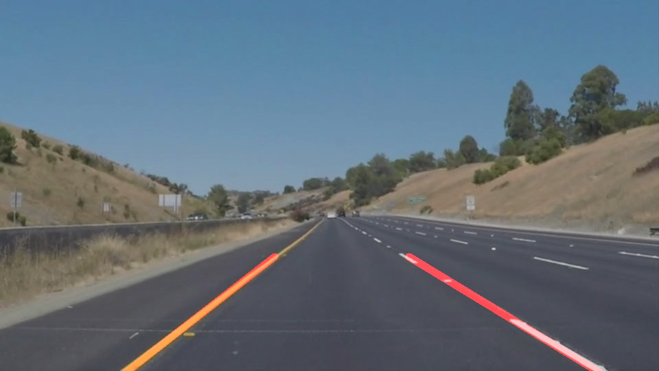

# **Finding Lane Lines on the Road** 

Overview
---

When we drive, we use our eyes to decide where to go.  The lines on the road that show us where the lanes are act as our constant reference for where to steer the vehicle.  Naturally, one of the first things we would like to do in developing a self-driving car is to automatically detect lane lines using an algorithm.

In this project you will detect lane lines in images using Python and OpenCV.  OpenCV means "Open-Source Computer Vision", which is a package that has many useful tools for analyzing images.  

# **Finding Lane Lines on the Road**

**Finding Lane Lines on the Road**

The goals of this project is to make a pipeline that finds lane lines on the road

[//]: # (Image References)

[image1]: ./examples/grayscale.jpg "Grayscale"
[origin]: ./test_images/solidWhiteRight.jpg "Origin"
[after]: ./test_images_output/solidWhiteRight.jpg "processed"

---

### 1. Run the Code
The project is written locally by Python IDE, which is saved in the 'lane_detection.py'.
So if it is possible, simply run the python file would get the results.
However, I also pasted the codes into the Jupter Notebook, it should be fine.

  

### 2. Final Results
In this project, several images and three videos would be processed to find lane lines. This part will show one of
the [origin] images first and then the [processed] output image.
All the output images are saved into test_images_output folder and videos are saved in the test_videos_output folder.

  

### 3. Pipeline Description.

The overall pipeline consisted of 5 steps.

    1. I selected the white and yellow areas. This strategy iis not used at the beginning of the project, however,
         it shows that adding this function could slightly increase the accuracy of identification.

    2. Defind region of interest for color selection and edge detection. in this part, i defined the apex of the
         triangle area as the point below the  middle point of the image.

    3. Change the image into grey scale and do gaussian blur. By doing so, the edges would be more apparent.

    4. Canny Edge detection. Find the edges inside the RoI , which is helpful to find the lines.

    5. Find hough lines and then draw them on the original image.

  

In order to draw a single line on the left and right lanes, I modified the draw_lines() function by ...

    1. Compute the slopes of each line.

    2. Filter the useless lines and classify the left lines and right lines by different slopes.
        In the case, I define the lines with ` slope < -0.68 ` as the left lanes and the ` slope > 0.68 ` are the right lanes.
        All the other lines would be discarded.

    3. Reshape the lines. Then I reshape each line matrix to get a matrix of points. In this way, I am able to maintain the points
        along the lane line.
        If the lane matrix is of shape (x, 4), the reshaped point matrix would be (x/2 , 2)

    4. Fit a line through the points. According to the points, I used the cv2.fitLine function to find the best line describe
        the lane line. In this project, the least square method is used to fit a line.

  

### 4. Identify potential shortcomings with your current pipeline

After several test cases, there are still many problems in current pipeline.

    1. One potential shortcoming would be what would happen when the lane lines cannot be clearly identified.

    2. Another shortcoming could be this pipeline would be strongly influenced with tree shallows on the road. It is severe because the shallows
    will be regarded as edges in the image.

    3. When processing the bend parts, it is not performing very well.

    4. The output quality of challenge.mp4 video is bad.

  

### 5. Suggest possible improvements to your pipeline

    1. There would be some methods to selected important hough-transformed lines and throw the bad results.

    2. Is it possible to remove the shallows on the road.

    3. The RoI should be self-adaptive when the vehicle is moving from a straight road to a bend road.

    4. By using the fitLine method, the output line is shaking in the videos, it would be better if it becomes more stable.
